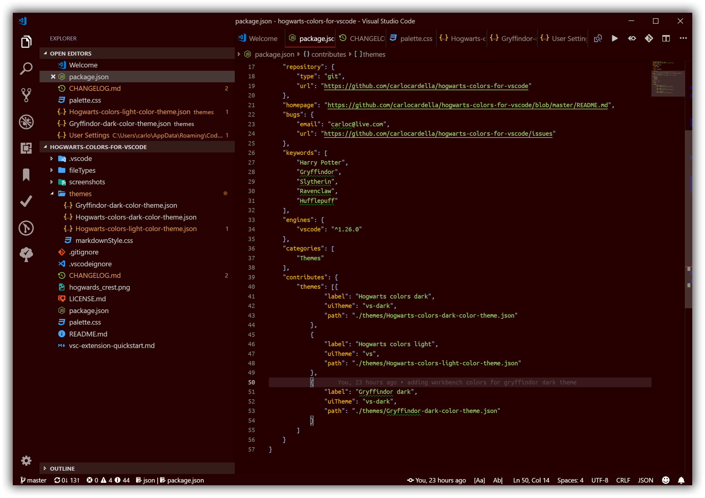

# Hogwarts colors for Visual Studio Code

Visual Studio theme colors inspired by Harry Potter, Hogwarts and Hogwarts Houses colors and banners.
Check the "screenshot" folder for samples of all themes in a number of different languages, feel free to contribute and add yours

_Note: this themes family is still work in progress, please expect changes, even extensive ones till the first major release (e.g. 1.0.0)_

### Installing

This extension is available for free in the [Visual Studio Code Marketplace](https://marketplace.visualstudio.com/items?itemName=CarloCardella.hogwarts-colors-dark)

### What's new?

Check the [Changelog](CHANGELOG.md)

### Inconsistencies?

If you find any inconsistency in any language, raise an Issue and I'll take a look, please provide a sample for the language so I can compare.

### Customization

If you are using VSCode version 1.12+ you can customize the colors to your liking: for more info see [here](https://code.visualstudio.com/docs/getstarted/theme-color-reference).

## Credits

- [tmTheme-Editor](https://github.com/aziz/tmTheme-Editor), for language samples
- [Pottermore](https://www.pottermore.com), for ideas and guidelines about colors to use and their meaning
    - [Colours](https://www.pottermore.com/writing-by-jk-rowling/colours)
    - [Red, green and shocking pink: the importance of wizarding world colours](https://www.pottermore.com/features/importance-of-wizarding-world-colours)
    - [How do you colour coordinate the wizarding world?](https://www.pottermore.com/features/Colour-coordinating-the-wizarding-world)
    - [Colours or Pottermore](https://images.ctfassets.net/bxd3o8b291gf/1o1zcpziH6uukemigE4yCa/b6895a88989fc821a23a58eac8b123ec/ColoursofPottermore_03.jpg?w=1330)
- [damngoodshindig.com](http://damngoodshindig.com/2016/11/03/printable-hogwarts-house-crests/) for the Hogwarts and House crests

## Workbench 

Hogwarts Dark

Hogwarts Light

Gryffindor Dark

## Languages

C#

Javascript 

JSon 

Markdown 

Perl 

Php 

Powershell 

Python 

Ruby 

Xml 

