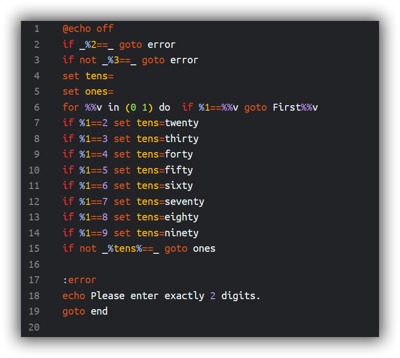
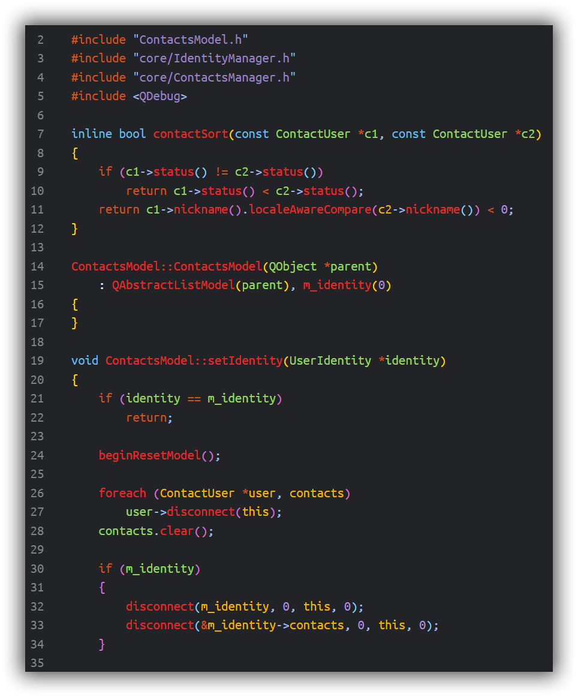
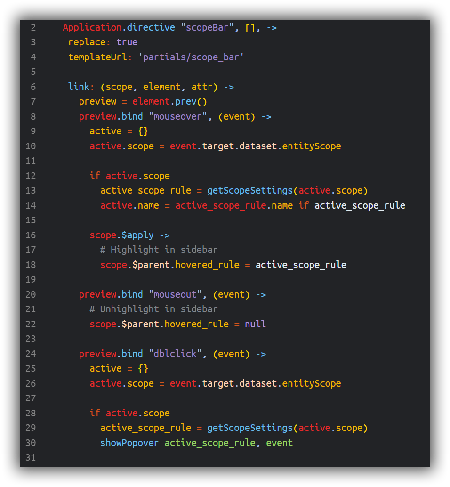
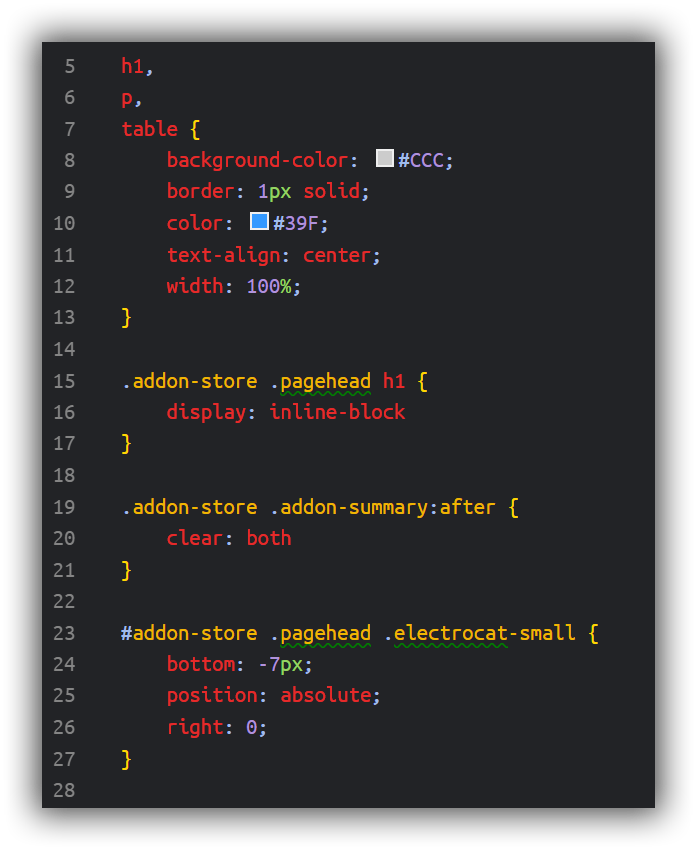
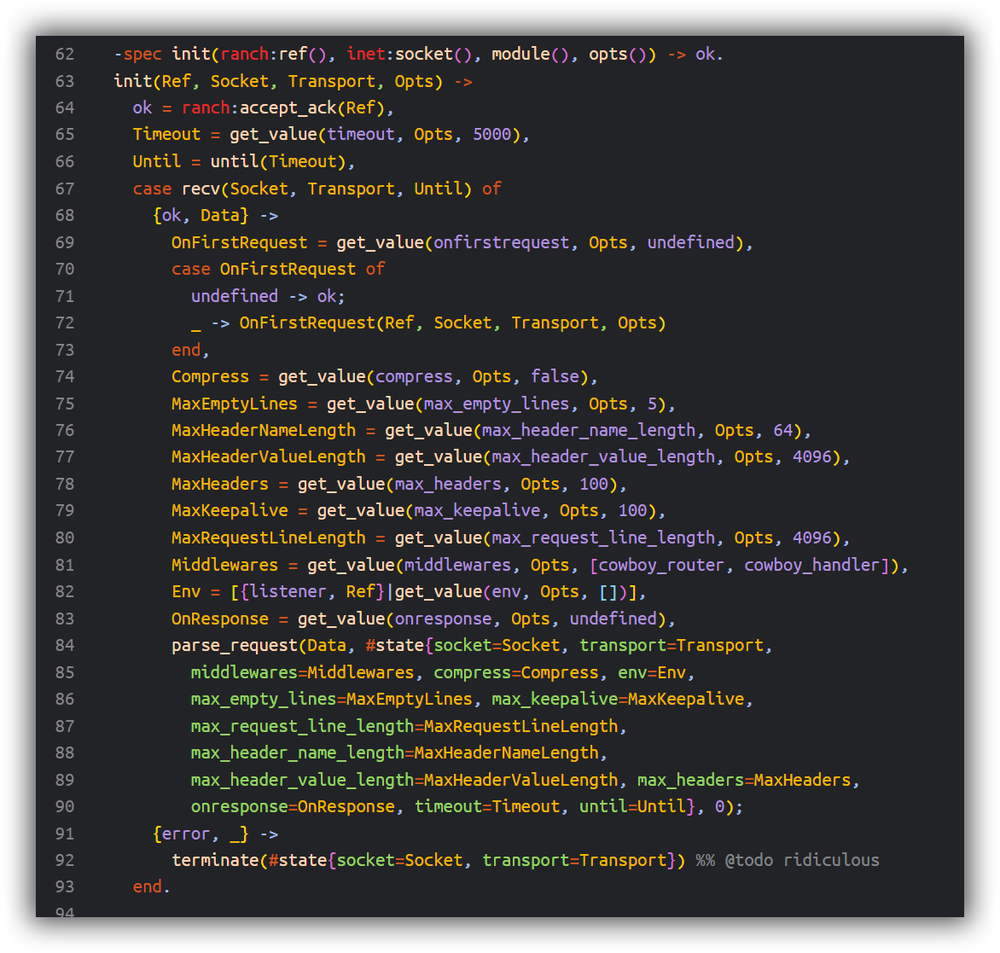
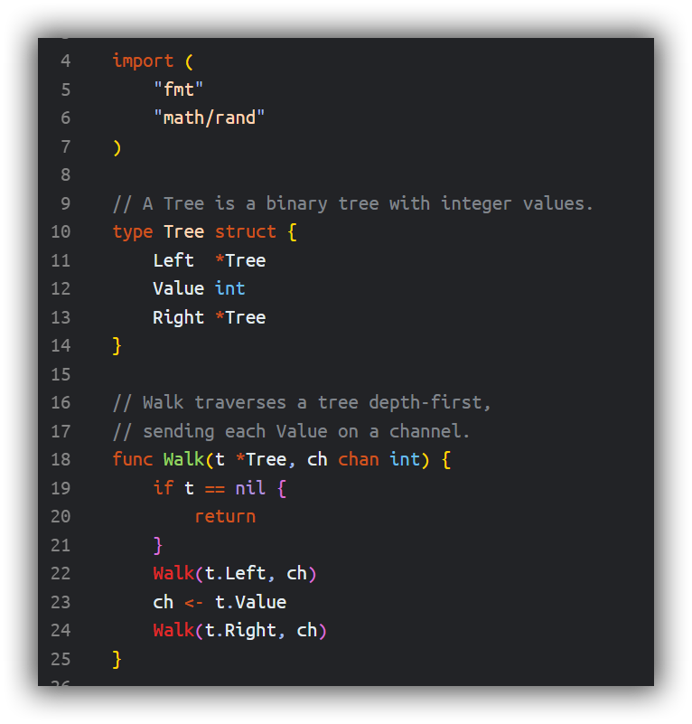
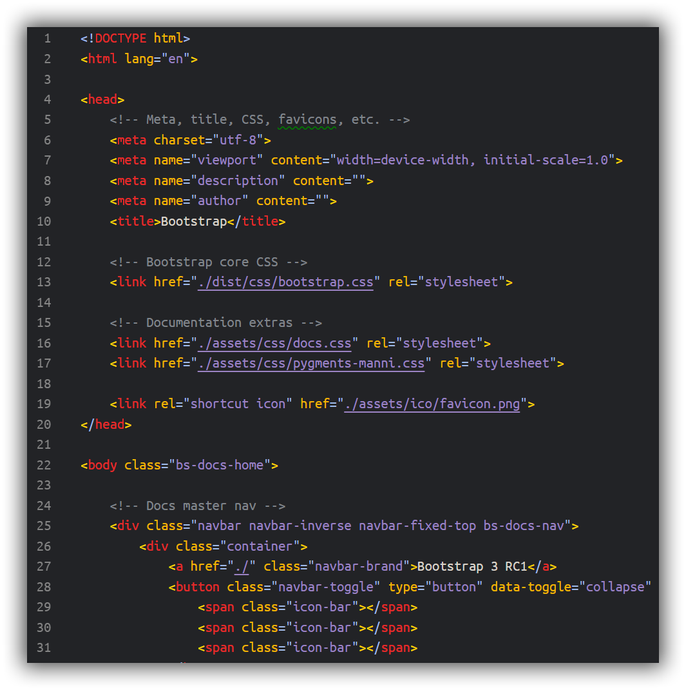
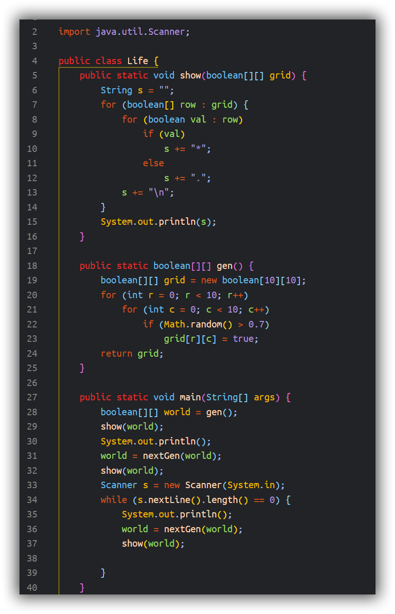
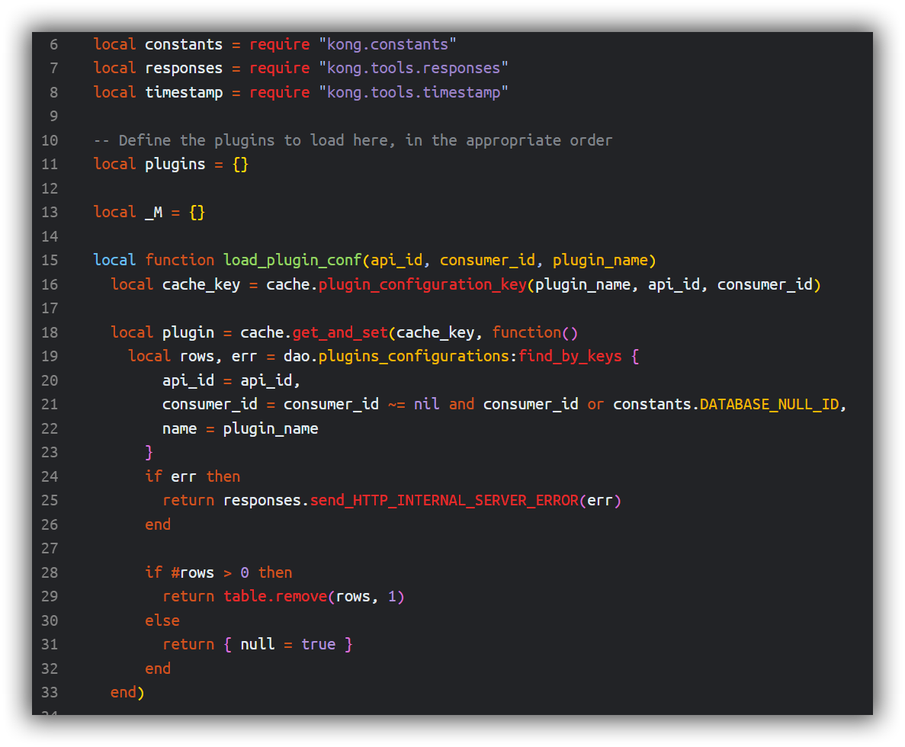
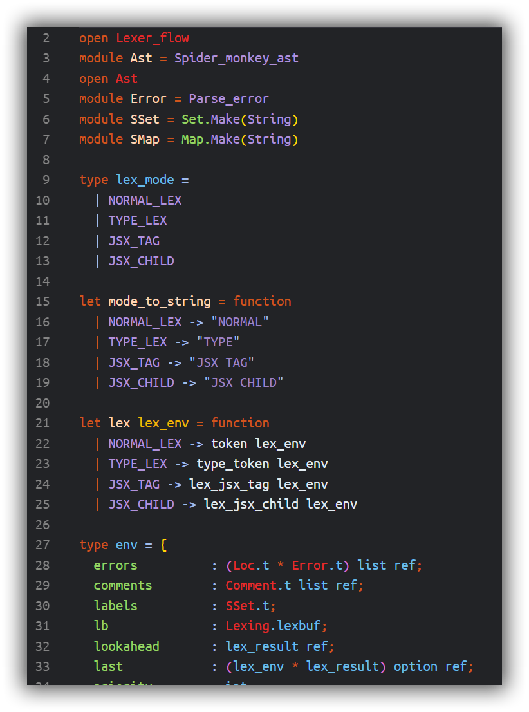

# Hogwarts colors for Visual Studio Code

Visual Studio theme colors inspired by Harry Potter, Hogwarts and Hogwarts Houses colors and banners.

## Languages

Batch 

C 

C++ 

Coffee Script 

C# 

CSS 

CSV 

Erlang 

Go 

Haskell 

Html 

Java 

Javascript 

JSon 

LaTeX 

Lua 

Markdown 

Objective C 

Ocaml 

Perl 

Php 

Plain Text 

Powershell 

Puthon 

R 

Ruby 

Typescript 

Xml 

Xslt 

### Installing

This extension is available for free in the Visual Studio Code Marketplace

### What's new?

Check the [Changelog](changelog.md)

### Inconsistencies?

If you find any inconsistency in any language, raise an Issue and I'll take a look, please provide a sample for the language so I can compare.

### Customization

If you are using VSCode version 1.12+ you can customize the colors to your liking: for more info see [here](https://code.visualstudio.com/docs/getstarted/theme-color-reference).

## Credits

- [tmTheme-Editor](https://github.com/aziz/tmTheme-Editor), for language samples
- [Pottermore](https://www.pottermore.com), for ideas and guidelines about colors to use and their stories
    - [Colours](https://www.pottermore.com/writing-by-jk-rowling/colours)
    - [Red, green and shocking pink: the importance of wizarding world colours](https://www.pottermore.com/features/importance-of-wizarding-world-colours)
    - [How do you colour coordinate the wizarding world?](https://www.pottermore.com/features/Colour-coordinating-the-wizarding-world)
    - [Colours or Pottermore](https://images.ctfassets.net/bxd3o8b291gf/1o1zcpziH6uukemigE4yCa/b6895a88989fc821a23a58eac8b123ec/ColoursofPottermore_03.jpg?w=1330)